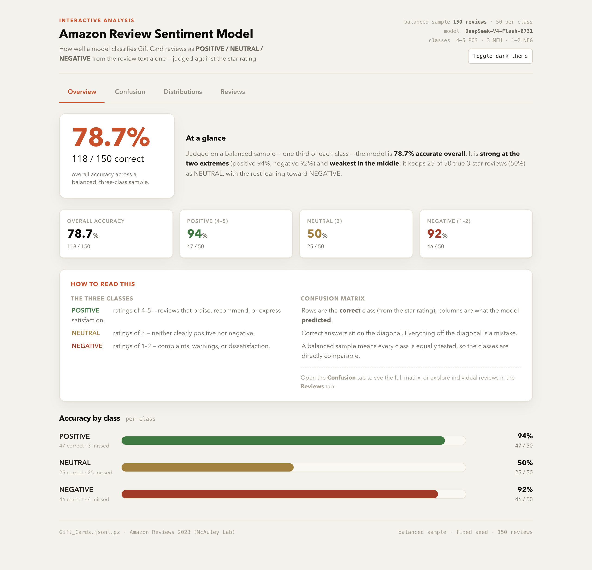
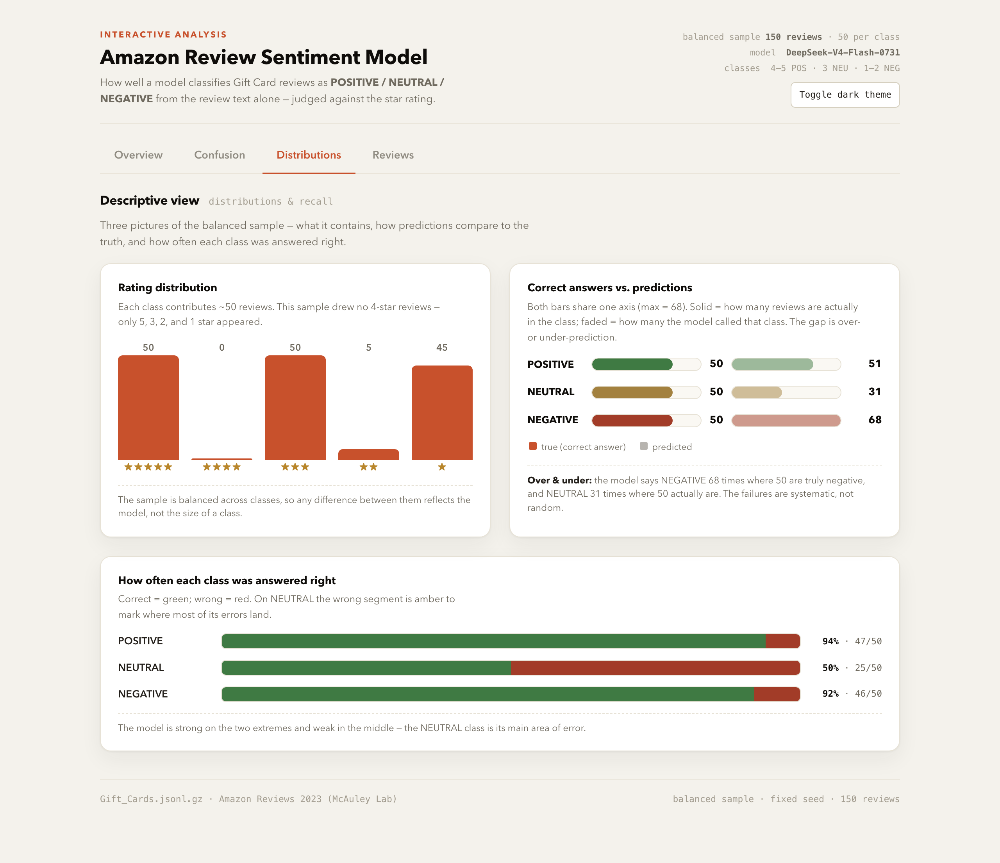

# Amazon Review Sentiment Model

An end-to-end project that builds, scores, and visually explores a large-language-model
classifier for Amazon reviews. Given a review's **title and text only**, the model
classifies its sentiment as **POSITIVE, NEUTRAL, or NEGATIVE**. The model never sees the
star rating; the rating is used only afterwards to judge how well the model did.

This repository contains the complete pipeline — the classifier prompt, the scoring
scripts, the NRC word-list emotion scorer, the balanced evaluation run's raw output, and
a self-contained interactive dashboard — plus this report.

---

## Data source

The project uses the **Gift_Cards** category split of the **Amazon Reviews '23** dataset:

> **Amazon Reviews 2023** — McAuley Lab, UC San Diego.
> Project page: <https://amazon-reviews-2023.github.io/>
> Dataset (Hugging Face): <https://huggingface.co/datasets/McAuley-Lab/Amazon-Reviews-2023>
> Paper: Hou, Li, He, Chan, … McAuley, *"Bridging Language and Items for Retrieval and Recommendation"* (arXiv:2403.03952)

The raw file used is the Gift_Cards review category
(`raw/review_categories/Gift_Cards.jsonl.gz`, ~152,410 reviews). It is a gzipped JSONL
file; each line is one review with fields including `rating` (the 1–5 star value),
`title`, `text`, `verified_purchase`, `helpful_vote`, `timestamp`, and `asin`. The raw
file is large and re-downloadable, so it is **not** committed to this repository
(see `.gitignore`).

---

## What this project does

1. **Classify** each review with an LLM (reached through an OpenAI-compatible endpoint)
   from its title + text **only** — the star rating is reserved purely for checking.
2. **Score** the model against the rating, using a **balanced** sample: a roughly equal
   number of reviews from each class, drawn from the whole file with a fixed random seed so
   the exact same set comes up every run.
3. **Detect emotions** two independent ways — the LLM's predicted primary emotion, and an
   NRC word-list scorer (no model calls) — and compare them.
4. **Visualize** everything in one finished, self-contained HTML dashboard.

### Sentiment classes (ground truth from the rating)

| Rating | Class |
|---|---|
| 4–5 | POSITIVE |
| 3 | NEUTRAL |
| 1–2 | NEGATIVE |

---

## Repository layout / working files

| File | Purpose |
|---|---|
| `classifier.py` | The reusable LLM prompt + prediction engine. Includes the system prompt, `classify_review()` (sentiment), `classify_with_emotion()` (sentiment + primary emotion), and tolerant JSON parsing. Config via environment variables (`OPENAI_BASE_URL`, `OPENAI_API_KEY`, `OPENAI_MODEL`). |
| `score_3class.py` | Scoring script for the **balanced three-class** evaluation. Reproducibly samples ~50 reviews per class from the whole file (fixed seed), calls the model, and outputs accuracy + a 3×3 confusion matrix. |
| `spot_check.py` | Quick 10-review sanity check on obviously positive/negative reviews + edge cases. |
| `nrc_emotion.py` | **Word-list emotion scorer** — derives a review's primary emotion from the NRC emotion lexicon (no model calls), for the LLM-vs-wordlist comparison. |
| `step5_emotion.py` | Runs the LLM-vs-NRC emotion comparison over a batch and saves per-review evidence. |
| `step6_tuned_scores.csv` | **Raw output of the balanced evaluation run** (150 reviews, seed 42): rating, true label, predicted label, primary emotion, correct, title, and text for every review. This is the source of every number quoted in the report. |
| `human_labels.csv` / `human_probe.html` | A small human-labeling probe on the 3-star reviews (see the Questions section). |
| `dashboard.html` | The final **interactive dashboard** — a single self-contained HTML file (no server, no external dependencies). Four tabs: Overview, Confusion, Distributions, and an explorable Reviews table. |
| `screenshots/` | PNG captures of the rendered dashboard, used in this report. |

The `score_batch.py` script (the Step-2 imbalanced 100-review run) is also included for
reference; the headline numbers in this report come from the **balanced** run.

---

## Dashboard

Open `dashboard.html` in any browser. It is fully self-contained — no build step, no
server.



*Overview tab: headline accuracy, per-class KPIs, a "How to read this" explainer, and
per-class accuracy bars.*



*Distributions tab: star-rating histogram, correct-answer-vs-prediction comparison, and
how often each class was answered right.*

It also has a dark theme and a filterable/sortable/searchable review table in the
**Reviews** tab.

---

## Results (from the balanced run)

All figures below are recomputed in this report directly from `step6_tuned_scores.csv`
(150 reviews, seed 42, 50 per class).

### Overall & per-class accuracy

| Class | Correct / total | Accuracy |
|---|---|---|
| **Overall** | **118 / 150** | **78.7%** |
| POSITIVE (4–5★) | 47 / 50 | 94% |
| NEUTRAL (3★) | 25 / 50 | 50% |
| NEGATIVE (1–2★) | 46 / 50 | 92% |

### Confusion matrix (rows = true class, columns = predicted)

| | pred POSITIVE | pred NEUTRAL | pred NEGATIVE |
|---|---|---|---|
| **true POSITIVE** (50) | **47** | 2 | 1 |
| **true NEUTRAL** (50) | 4 | **25** | 21 |
| **true NEGATIVE** (50) | 0 | 4 | **46** |

The model is strong at the two extremes (POSITIVE 94%, NEGATIVE 92%) and noticeably weaker
in the middle (NEUTRAL 50%).

---

## The four questions

### 1. Why did the lopsided run look very accurate, and what did balanced sampling change?

The first evaluation read the first 100 rows in order. Because the raw Gift_Cards data is
heavily skewed toward high ratings, that batch was **88% POSITIVE**. The model agreed with
the rating on **98%** of it. But a trivial baseline — always answer "POSITIVE", never
reading a word — would itself score **88%** on that same batch. So the 98% was largely an
artifact of an easy, imbalanced sample, not proof the model was excellent.

Balanced sampling fixed this by drawing a roughly equal number (~50) from each class from
the whole file. On that fair sample, overall accuracy drops to **78.7%**. The difference is
not a regression in the model — it is the same model being tested fairly, where a
random/majority baseline scores only ~33% (chance) rather than ~88%. Balanced sampling is
what surfaced the model's real weakness, the **NEUTRAL class**: in the first balanced run it
kept only **18%** of true 3-star reviews as NEUTRAL, a figure the skewed batch had hidden
almost entirely by barely including any. Prompt tuning (see Question 4) then raised it to
**50%**.

### 2. Where do the model's mistakes go — which classes get confused, and in what direction?

From the confusion matrix above, the mistakes are **not** symmetric:

- **NEUTRAL (3★) reviews get pulled toward NEGATIVE.** Of 50 true NEUTRAL reviews, the model
  keeps **25** as NEUTRAL, but calls **21 NEGATIVE** and **4 POSITIVE**. So the dominant
  error is 3-star reviews being labeled negative — they often contain a reservation or a
  complaint that the model reads as dissatisfaction.
- **NEGATIVE reviews are rarely lost.** True NEGATIVE is the cleanest class: **46/50**
  correct, with only **4** drifting to NEUTRAL and **0** to POSITIVE.
- **POSITIVE reviews rarely leak to NEGATIVE.** POSITIVE is **47/50**, with just **1** called
  NEGATIVE and **2** NEUTRAL.

In short: the model excels at the two extremes and its mistakes cluster **from NEUTRAL into
NEGATIVE** (21 of the 25 NEUTRAL misses). The direction is "neutral → negative," not the
other way.

### 3. How do the LLM's emotions and the word list's emotions differ, and why?

The LLM predicted a primary emotion for every review. The NRC word-list scorer derived one
by counting emotion-bearing words. They agreed on only **15 of 73** reviews the word list
could score (**~20.5%**), and the word list found no emotion at all in **27 of 100** reviews.

They differ because they use completely different evidence:

- **The LLM reasons about the whole review's tone and meaning**, inferring emotion
  pragmatically (for example, `joy` for satisfied reviews, `anger`/`sadness` for negative
  ones). It reads meaning, sarcasm, and context.
- **The word list counts word matches only.** It ties single words to emotions (e.g. `gift`
  carries `anticipation`), so Gift-Card vocabulary biases it heavily toward `anticipation`,
  and it misses words like *great* or *good* that aren't in the lexicon. It cannot infer
  tone from context.

The practical upshot: the dictionary method is cheap but brittle on this domain's
vocabulary, while the LLM is far more accurate but requires model calls. (None of the
earth-shattering — it is the standard dictionary-vs-neural-sentiment gap, made concrete on
this dataset.)

### 4. What bugs and/or issues did you hit along the way, and how were they worked around?

A short log of the notable issues, both in code and in the visual work:

- **A scoring/display bug in the evidence CSV.** The balance-run output had a cosmetic
  "ERROR" showing in an error column even on successful rows. It was a display artefact in
  the writer, not an error — the underlying numbers were correct. Fixed the writer and
  rebuilt the file; re-verified all figures still matched.
- **In a "plain" accuracy number.** A high 98% on a heavily positive batch looked great but
  was mostly the skew — solved by switching to **balanced sampling**, which is the real fix
  (see Question 1).
- **A class that kept silently collapsing.** The 3-star (NEUTRAL) class scored much worse
  than the others. To check whether that was an inherent property of the data or an
  improvable model weakness, I built a small **human-labeling probe** on the 50 three-star
  reviews (`human_probe.html` / `human_labels.csv`). A human reader labeled them, giving a
  natural "ceiling" for how well any model could do. This showed the model was genuinely
  below an achievable bar (it over-predicted NEGATIVE), and prompt tuning moved NEUTRAL from
  18% to 50% while keeping the extremes strong.
- **Dashboard: bars rendering as thin flat lines instead of bars.** The star-rating
  histogram collapsed to ~3px lines because a percentage-height bar had no resolved parent
  height. Fixed by giving each bar a proper fixed-height track, and verified the fix in a
  real headless browser (proportional heights: 134/2/134/13/121 px for 5★=50, 4★=0, 3★=50,
  2★=5, 1★=45).
- **Process: "correct numbers" vs "rendered numbers."** Programmatic checks confirmed the
  figures against the saved output, but a visual pass caught the histogram that a numeric
  check (which only validated "not zero-sized") had missed. The lesson: verify numeric
  correctness *and* visual rendering, ideally in the actual browser.

---

## Reproducibility

- **Fixed seed** — the balanced sample is drawn with a fixed random seed (42), so the same
  150 reviews are used every run.
- **One evidence file** — `step6_tuned_scores.csv` is the raw output and the single source
  of truth for every number in this report.
- **Configuration via environment variables** — endpoint, key, and model are read from env
  vars, so no credentials are committed.

To reproduce:

```bash
# 1. create a virtual environment and install the client
uv venv --python 3.11 && source .venv/bin/activate
uv pip install openai NRCLex

# 2. point at the class endpoint (set your own values)
export OPENAI_BASE_URL="https://your-host/v1"
export OPENAI_API_KEY="your-key"
export OPENAI_MODEL="your-model"

# 3. score the balanced 150-review sample (seed 42) -> step6_tuned_scores.csv
python score_3class.py --per-class 50 --seed 42 --out step6_tuned_scores.csv

# 4. open the dashboard
open dashboard.html
```

The large data file is assumed to be present at `Gift_Cards.jsonl.gz`; see the Data source
section for where to download it.

---

## License / notes

This is coursework. The dataset is the Amazon Reviews 2023 collection (McAuley Lab),
used here for educational evaluation. Sentiment labels derived from the star ratings
follow the category definitions in this report.
